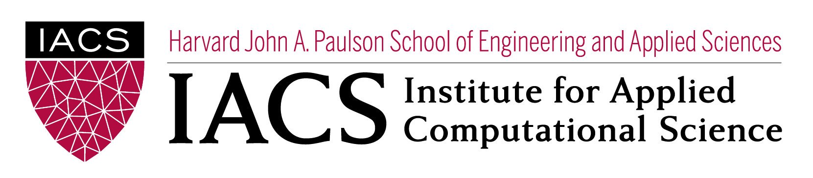

<p align="center"></p>

<br>

# ComputeFest 2019: Interpretability + Fairness Workshop

### Resources:

We cite most of our resources in the slide deck and the notebook, but another key resource in developing this material is this online [book](https://christophm.github.io/interpretable-ml-book/) on interpretability.

### Instructions: 

Note: You must have Python 3.6

Install with the following steps:

```
$ git clone https://github.com/pblankley/interp-workshop-2019.git
$ cd interp-workshop-2019
$ ./make_env.sh
```

These steps will create a virtual environment, install the necessary dependencies, and launch a jupyter notebook in the virtual environment.

Let one of the instructors know if you have any issues! 

### Contact Information:

Feel free to contact the instructors with questions regarding the content and presentation.

- Paul Blankley (paul@exquanta.com)
- Camilo Fosco (camilofosco@gmail.com)
- Ryan Janssen (ryan@exquanta.com)
